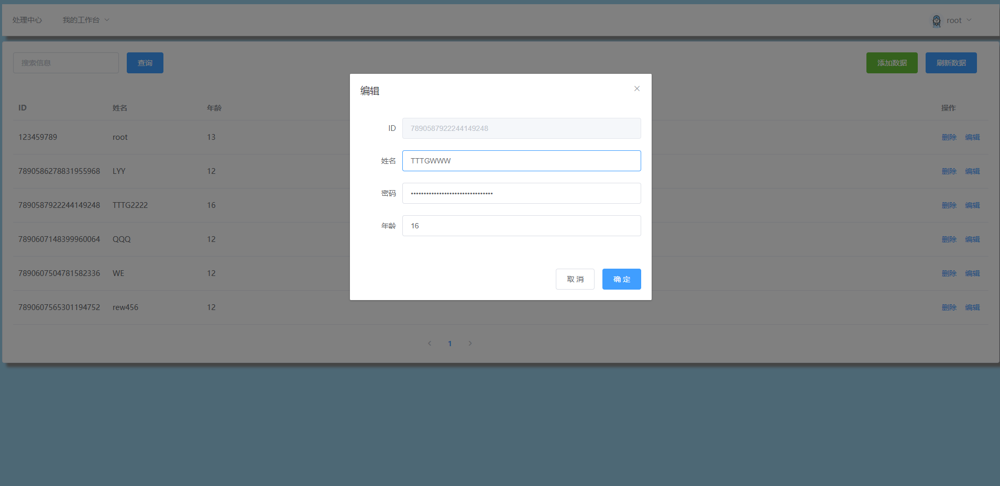

## 1、具体技术

- 后端：springboot + springmvc + mybatis
- 数据库：mysql
- 前端：vue2.x + element UI

## 2、主要功能

1、  用户登陆/退出

2、  用户增删改查

## 3、具体功能展示

## 3.1 登陆页

> 前端设置了路由拦截功能，会判断用户是否有登陆信息，若用户未登陆则默认只放行登陆界面，其余拦截。

## 3.2 登陆成功

展示列表数据，包括添加用户，删除用户，查询用户，修改用户

## 3.3 添加用户

## 3.4 删除用户

删除用户时会弹出提示

## 3.5 更新用户

## 3.6 查询用户

可以对用户名进行模糊查询

## 3.7 退出登陆

用户退出登陆会返回登陆界面

